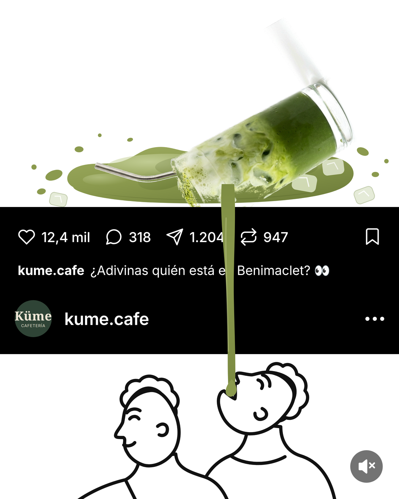

# Post de Instagram — «¿Adivinas quién está en Benimaclet?»

Pieza de feed para **@kume.cafe** en el formato de post-dentro-del-post: el
producto se derrama por arriba, una banda negra reproduce la interfaz de
Instagram y el hilo de matcha la atraviesa hasta caer en la boca de una
ilustración de línea en la parte inferior.



## Archivos

| Archivo | Qué es |
| --- | --- |
| `post-matcha-benimaclet.png` | **Entregable.** 1080 × 1350 (4:5), listo para publicar |
| `post-matcha-benimaclet@2x.png` | Master a 2160 × 2700 por si hace falta reencuadrar |
| `post.html` | Fuente de la composición (todo vectorial salvo la foto del vaso) |
| `assets/vaso-volcado.png` | Vaso de matcha recortado y volcado, con alfa |
| `prep_vaso.py` | Genera `assets/vaso-volcado.png` a partir de la foto de carta |
| `render.js` | Rasteriza `post.html` a PNG con Chromium |
| `fonts/` | Inter y Noto Serif (las tipografías del sistema de marca Küme) |
| `pie-de-foto.md` | Copy y hashtags para publicar |

## Cómo regenerarlo

```bash
cd instagram/post-matcha-benimaclet
python3 prep_vaso.py     # solo si se cambia la foto de origen
node render.js           # escribe post-matcha-benimaclet@2x.png
python3 - <<'PY'
from PIL import Image
Image.open('post-matcha-benimaclet@2x.png').convert('RGB') \
     .resize((1080,1350), Image.LANCZOS).save('post-matcha-benimaclet.png')
PY
```

`render.js` usa el Chromium del entorno. Si está en otra ruta:
`CHROME_BIN=/ruta/a/chrome node render.js`.

## Qué es fácil de tocar

- **Texto del pie:** `#t-pie` en `post.html`.
- **Cifras de la barra:** `#n-likes`, `#n-coments`, `#n-envios`, `#n-repost`.
  Son decorativas, no son métricas reales de la cuenta.
- **Usuario y avatar:** `#t-user1`, `#t-user2` y el bloque `.avatar`.
- **Otro producto:** cambia la foto en `prep_vaso.py` (`SRC`) y ajusta `ANGLE`;
  después revisa los verdes del charco en `:root` y en los degradados
  `gCharco` / `gLengua` / `gHilo`.

## Referencias de marca usadas

- Verde salvia `#536345` y verde del rótulo `#2f4436` (`DESIGN.md`).
- Crema `#efe7d6` para el texto del avatar.
- Tipografías Noto Serif (rótulo) e Inter (interfaz).
- Foto de producto: `Kume menus/images/cafe-matcha-latte.png`.
- Dirección y usuario tomados de `index.html`.
